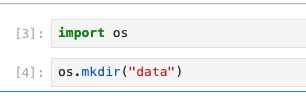

# Running Pytorch from Jupyter and see files

Substrate comes with a Jupyter installation. This doc explains how to run a Pytorch examples.

1. Update your substrate installation.

2. visit https://substrate.home.arpa/jupyverse and go through the self certified credential warning.

3. Make a new page with the content of MNIST.ipynb, or open it somewhere and check inside.

4. The first block shown below:

Executing this creates a directory in the "space" for this session to store data to be used in this example.

5. Execute the large block of function definitions. This is almost verbatim copy of [Pytorch standard example](https://github.com/pytorch/examples/blob/main/mnist/main.py) except it has a `print` function to show that `use_cuda` is `True`, the path to store training and test data is modified to use the directory created above, and fix the argument parsing issue that is common when [running Pytorch example in Jupyter](https://stackoverflow.com/questions/48796169/how-to-fix-ipykernel-launcher-py-error-unrecognized-arguments-in-jupyter).

6. Execute the `main()` cell. It'll fetch data and run training and displays the test result.

7. The files are stored in `/var/lib/substraterefs/spaces/sp-.../tip/tree`, where `sp-...` is the key of the space shown in the URL when you access `https://substrate.home.arpa/jupyverse`.
