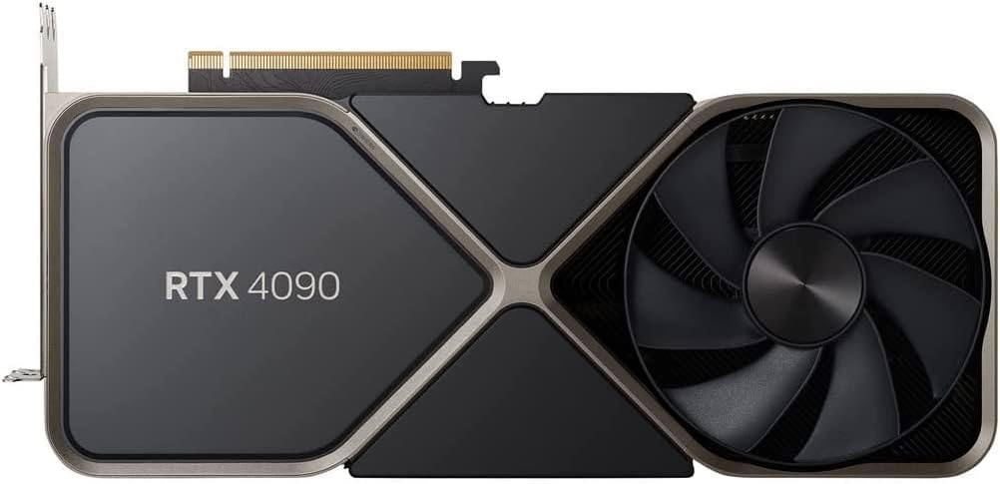
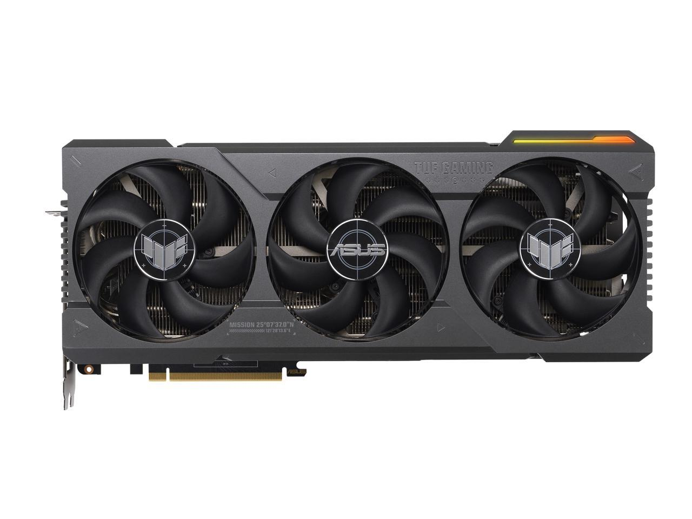
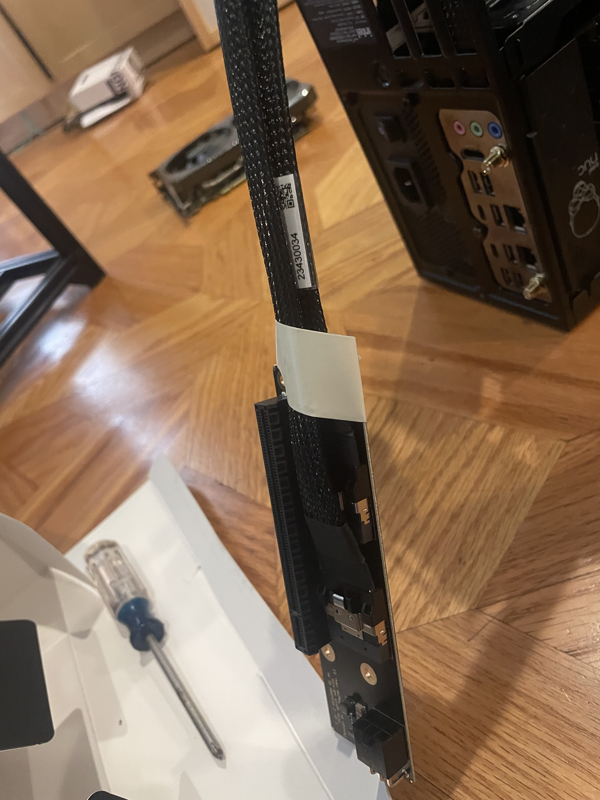
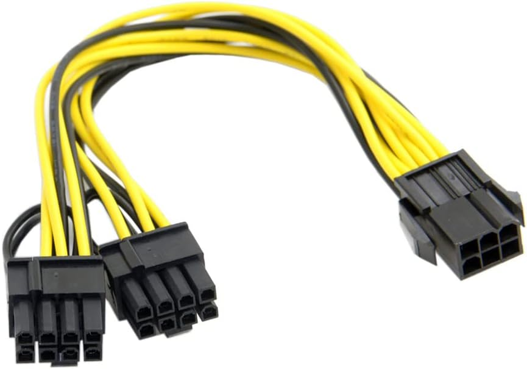
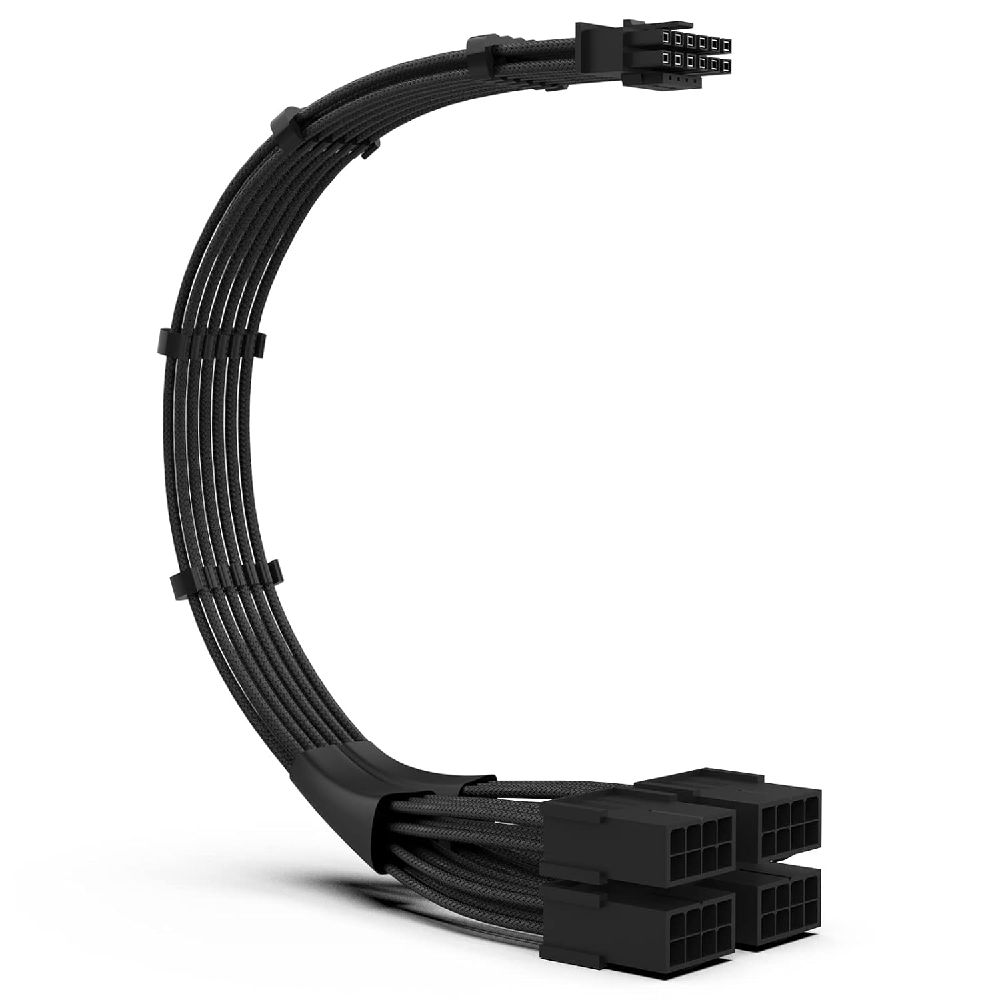
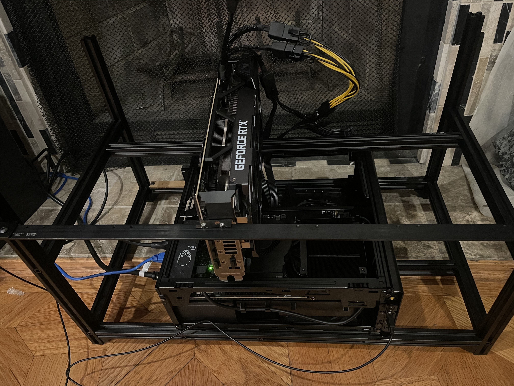

# Setting up Intel NUC with RTX 4090 TUF

The NVIDIA GeForce 4090 product line has the "Founders Edition" and other editions. The Founder Edition is smaller; its long edge is basically two and half fan radius. The bigger model has three fans, and unfortunately, it does not fit in the Intel NUC case.

So we need a housing for the GPU unit that lives outside the NUC box.

This rack (https://www.amazon.com/dp/B073SMF21G) is what is used by some. Its manual has some errors, and the smaller hex wrench that comes with the set does not fit. You also eyeball the height of FS-12 (the back bar) so that the GPU cards tab comes at the right height. But otherwise, it does its job.

We conenct the GPU to the PCIe slot with a set of extension cables and adapters.

This is the "host adapter" that goes into the PCIe slot of NUC. It has two SlimSAS cable sockets:

https://c-payne.com/products/pcie-slimsas-host-adapter-x16-to-2-8i

And two SlimSAS cables:

https://c-payne.com/products/slimsas-sff-8654-8i-cable-straight-pcie-gen4-85ohm

and then at the other end of the cables, we have another adapter called "device adapter":

https://c-payne.com/products/slimsas-pcie-device-adapter-2-8i-to-x16

Installing the host adapter is straightforward, just make sure to open the latch to install it and then close it afterwards.

The two cables should not cross: the one that goes to the cutout side of the host adapter should go to the cutout side of the device adapter. You also connect the 6-pin power from NUC to the host adapter.

Those three cables fit somewhat tightly. Once you plug them in, it is good to wrap masking tape around it so make it stable.

Providing power to the GPU unit requires a power splitter cable (https://www.amazon.com/dp/B075SG2Y4F). This product in the picture is yellow but I'd recommend a black cable as it matches with the rest of equipments better. 

Make sure to find the power adapter cable that should be bundled in the RTX 4090 package:

The output end (the "1" end) of this cable is a 12-pin connector that goes into the top side of the 4090 GPU. For the 4 input, you need to supply power at least 3 of those. You put the splitter to one of remaining two power cables from the power supply of NUC to make them three, and plug them into 3 of 4 inputs. If you have another and bigger power supply unit outside of NUC, that should work.

The power cables are limited in length. I removed the side panel and routed the cable through the big space.

