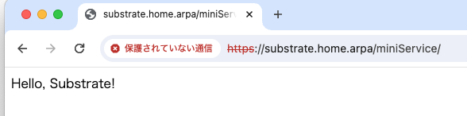
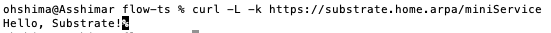

# Adding a very simple service to substrate.

You basically follow the instruction from line 27 in this file:

https://github.com/ajbouh/substrate/pull/91/files

with some modifications.

To add a service that is based on a simple web server perhaps written in NodeJS with Express sesrver.

1. Create a directory called `images/miniService`.
2. Create `index.js` in `images/miniService` that looks like: 

```JavaScript
const express = require('express')
const app = express()
  
app.use(express.urlencoded({ extended: true }))
app.use(express.json())
  
app.get('/', (req, res) => res.send('Hello, Substrate!'))
  
app.listen(process.env.PORT, () => console.log(`⚡️[bootup]: Server is running at port: ${process.env.PORT}`))
```

Note that the PORT is given by substrate as an environment variable
called PORT. So if your source has a hardcoded port number you have to
change it.

3. Create `package.json` in `images/miniService` that looks like:

```JavaScript
{
  "name": "miniservice",
  "version": "1.0.0",
  "main": "index.js",
  "license": "ISC",
  "dependencies": {
    "express": "^4.18.2"
  }
}
```

4. Create `Dockerfile` in `images/miniService` tha looks like:
```
# Fetching the minified node image on apline linux
FROM node:slim

# Declaring env
ENV NODE_ENV development

# Setting up the work directory
WORKDIR /express-docker

# Copying all the files in our project
COPY images/miniService/. .


# Installing dependencies
RUN npm install

# Starting our application
CMD [ "node", "index.js" ]

# Exposing server port
EXPOSE 5000
```

5. Create `defs/miniService.cue` that looks like:

```
package defs
enable: "miniService": true
imagespecs: "miniService": {}
lenses: "miniService": {
}
```

6. Do `git add `images/miniService defs/miniService.cue` to tell the `./remote dev.sh` to include those files.

7. Run `/remote ./dev.sh systemd-reload`

8. Access https://substrate.home.arpa/miniService



or from the terminal:




