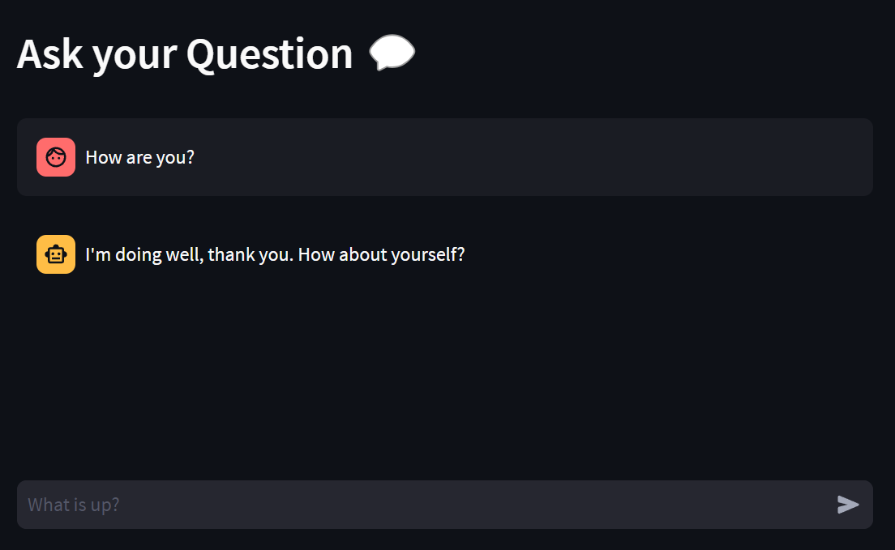

## Streamlit bot



This is an example to deploy a Streamlit bot with LocalAI instead of OpenAI. Instructions are for Windows.

```bash
# Install & run Git Bash

# Clone LocalAI
git clone https://github.com/go-skynet/LocalAI.git
cd LocalAI

# (optional) Checkout a specific LocalAI tag
# git checkout -b build <TAG>

# Use a template from the examples
cp -rf prompt-templates/ggml-gpt4all-j.tmpl models/

# (optional) Edit the .env file to set things like context size and threads
# vim .env
# Download model
curl --progress-bar -C - -O https://gpt4all.io/models/ggml-gpt4all-j.bin > models/ggml-gpt4all-j.bin

# Install & Run Docker Desktop for Windows
https://www.docker.com/products/docker-desktop/

# start with docker-compose
docker-compose up -d --pull always
# or you can build the images with:
# docker-compose up -d --build
# Now API is accessible at localhost:8080
curl http://localhost:8080/v1/models
# {"object":"list","data":[{"id":"ggml-gpt4all-j","object":"model"}]}

curl http://localhost:8080/v1/chat/completions -H "Content-Type: application/json" -d '{
     "model": "ggml-gpt4all-j",
     "messages": [{"role": "user", "content": "How are you?"}],
     "temperature": 0.9
   }'

# {"model":"ggml-gpt4all-j","choices":[{"message":{"role":"assistant","content":"I'm doing well, thanks. How about you?"}}]}

cd examples/streamlit-bot

install_requirements.bat

# run the bot
start_windows.bat

# UI will be launched automatically (http://localhost:8501/) in browser.

```

